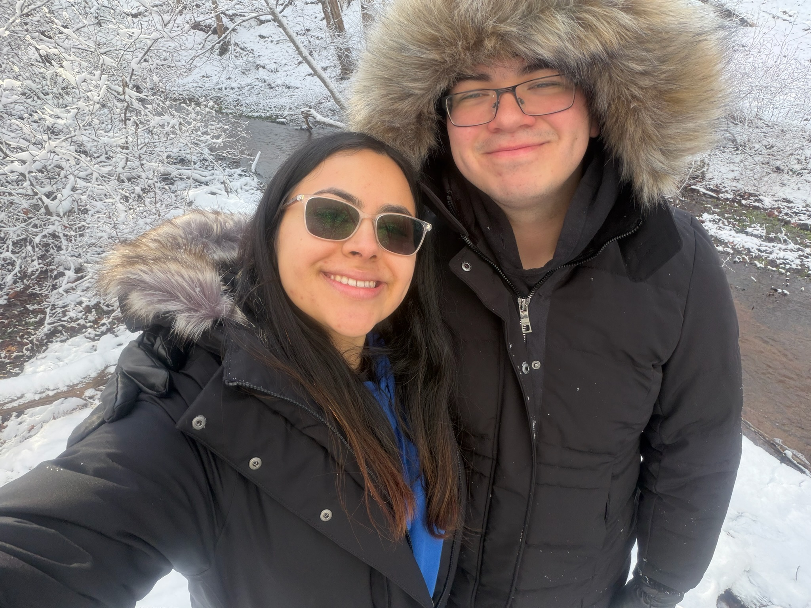
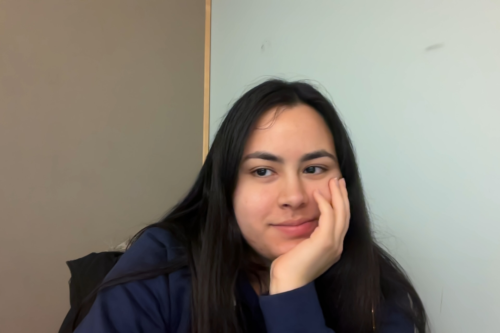
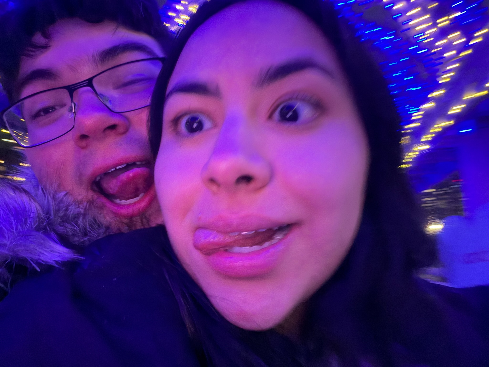
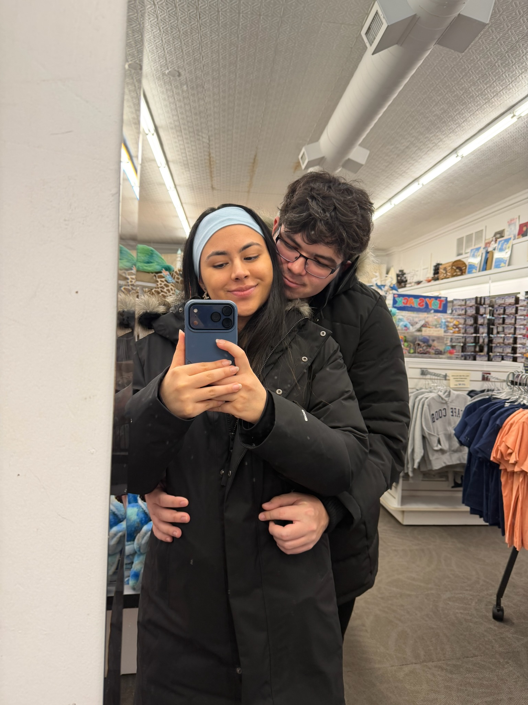

<button class="heart-button" onclick="shootHearts()">WHOOOOOOOOOOO</button>

hi baby

  <video autoplay loop muted playsinline width="600">
    <source src="images/me_and_baby.mp4" type="video/mp4">
  </video>

Oh baby, my baby 
How are you doing today? 
I hope its the sweetest 
You know im sincere - est 
When I wish you love from far away.

Twenty two years of age you are 
Wow you must really be so wise 
And throughout her days, 
she still has the prettiest gaze 
And is beautiful from her head knees toes and thighs!

You truly make me feel so special baby 
I really hope you know that well. 
Because If I was there right now, I cook you a dish 
It would taste so delish 
It may even be better than Taco Bell.

I really can't wait until we're together 
And hug you so tightly, it be a charm! 
Because even if we are always late 
I'm telling you there is nothing more great 
Than just laying and cuddling in each others arms.

I loved every second I've spent with you 
these past several months, wow its really flew by! 
From the dream that was Tampa, To the night in Boston, 
And the heaven of Cape Cod, and then again out in Boston, 
It couldn't get any better, I could cry

And it wasn't so long ago, we hadn't talked at all 
(Except for all those desperate texts to you) 
And then you reached out 
On my birthday, whats this about? 
We're nearly full circle, now it's you're twenty-two!

Oh baby, my baby, me sweet dearest, my one dearest 
How are you doing today, oh yes? 
It's my favorite question to ask 
It will always be my task, 
Because you mean the world to me, my princess.

